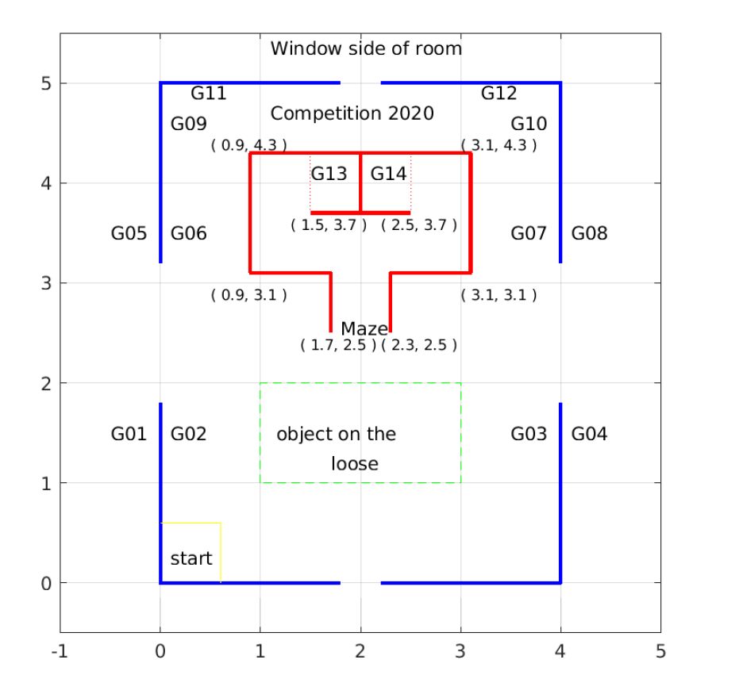

# Final Assignment - 31388 Advanced Autonomous Robot
## Run the script  
bash main.sh
## Configuration  
- see in objConfig.yaml

## Language
- SMR-CL
- C
## Process
1. Start from a 60x60 square
2. Go to the first guidemark given in advance
3. Read and Move
4. Is the guidemark number 98?  
- Yes: step 5
- No: step 3
5. Go around the green square: (1,1), (1,2), (3,1), (3,2)
6. Find the object with RANSAC, coordinate transformation

## Process
[x] follow guidemark    
[ ] object detection
- [x] spawn objects
- [ ] detect objects
